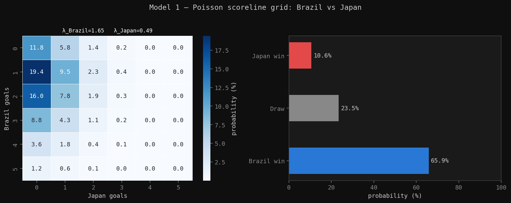
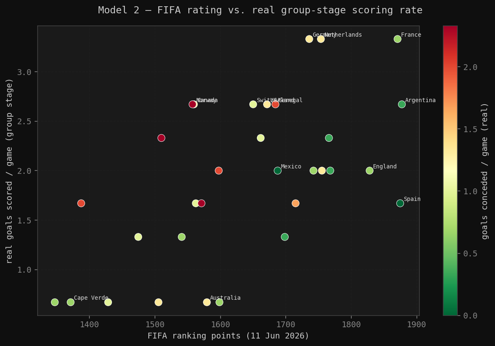
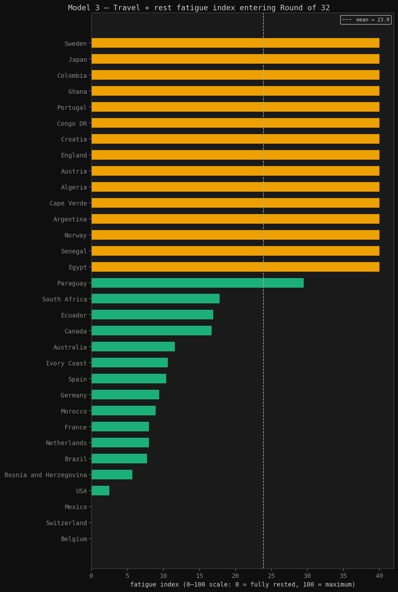
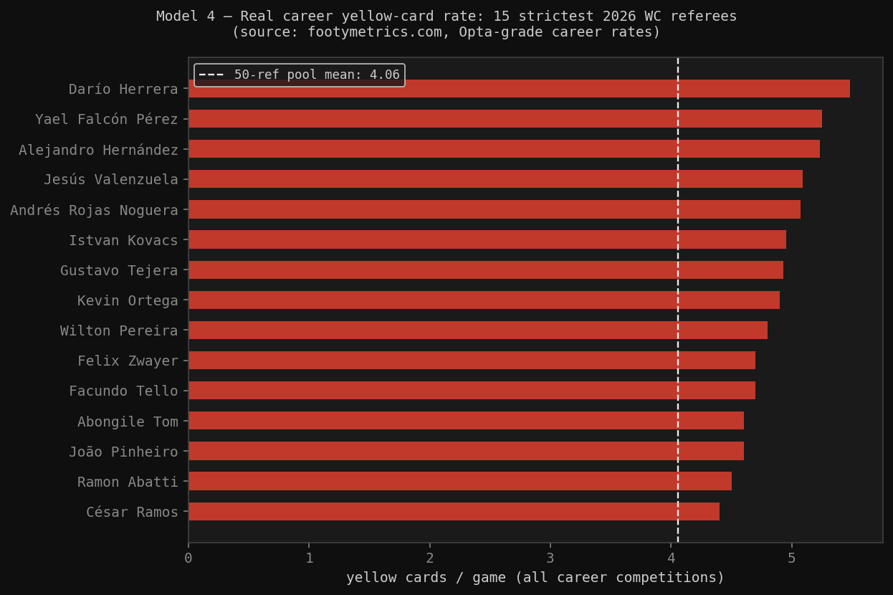
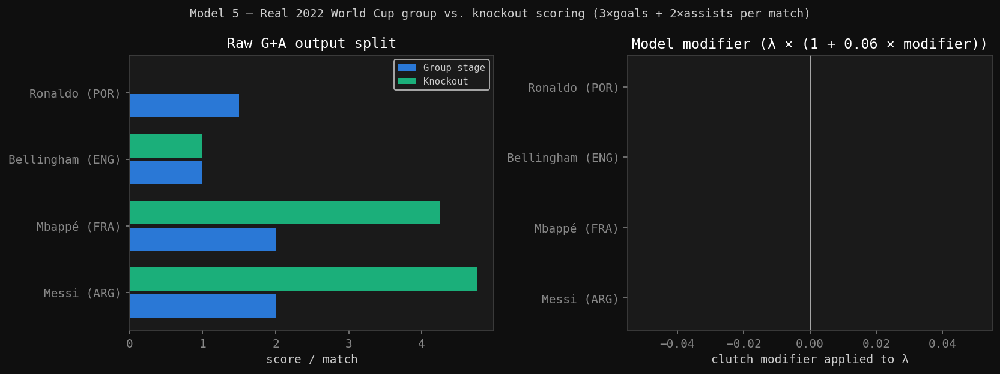
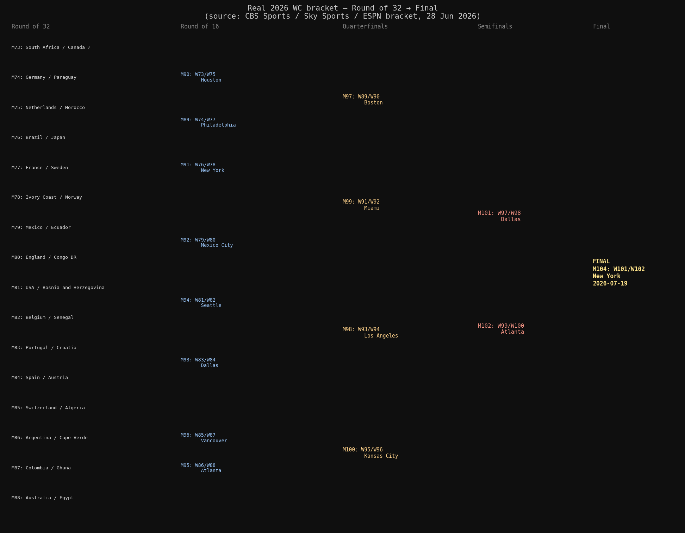
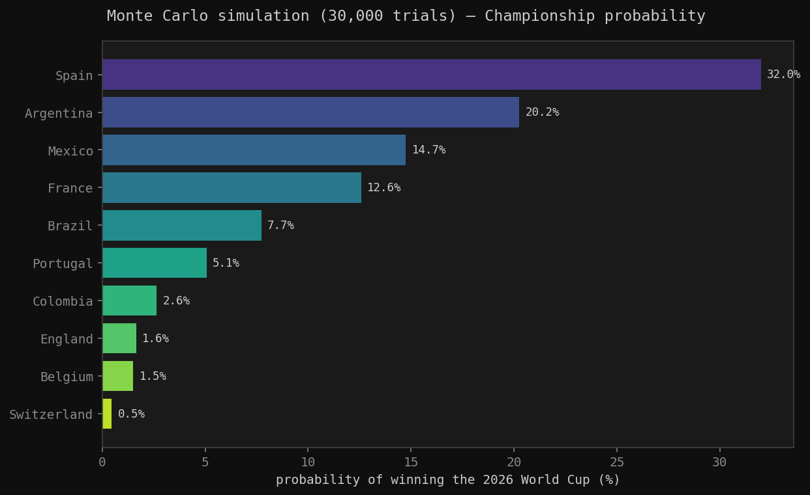
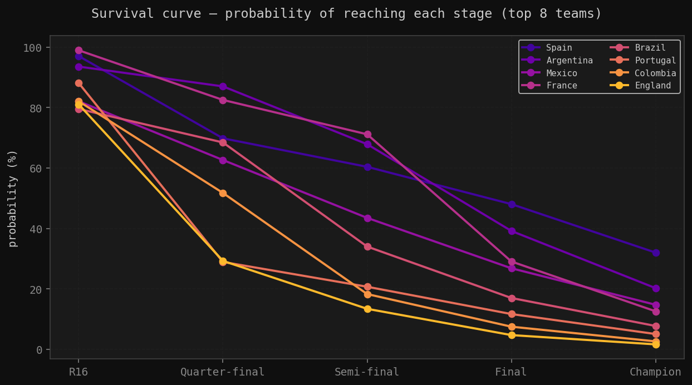

# Predicting the 2026 World Cup With Math
*June 30, 2026*

---

## Background

Every four years, the world's most watched sporting event produces billions of predictions. Pundits fill airtime with opinions, fans run polls, and everyone has a hot take about who's going to win. Most of them are wrong, and the ones that are right are usually lucky.

I wanted to try something different. I wanted to build a model where the uncertainty is the point — where instead of saying "Spain will win," you say "Spain wins in 32% of simulated universes, and here's exactly why."

I should also be upfront about one personal bias going into this. I'm a Ronaldo fan. Before writing a single line of code, my gut said Portugal had a real shot. Most top pundits disagreed. So I ran the math myself, and the math — as you'll see — largely sided with the pundits. More on that in Model 5.

The 2026 World Cup is the biggest in history: 48 teams, three host nations (USA, Mexico, Canada), and a brand new Round of 32. By the time the group stage finished, 215 goals had been scored across 72 matches. That's the foundation everything is built on.

The model has five layers, each handling a different dimension of the problem.

---

## Model 1: Poisson Goal Scoring

The starting point is the simplest question you can ask: given two teams, how many goals do we expect?

Football goals follow a **Poisson distribution** reasonably well. The Poisson distribution models events that occur randomly and independently at some known average rate. The key assumption is that a goal happening at the 34th minute doesn't make a goal at the 67th minute more or less likely — each moment is independent. This isn't perfectly true in football (teams change their shape after going ahead, tiredness sets in), but it's a workable approximation and is standard in the academic literature on football prediction.

The Poisson probability of observing exactly $k$ goals is:

$$P(X = k) = \frac{e^{-\lambda} \lambda^k}{k!}$$

where $\lambda$ is the expected number of goals (the rate parameter). So to use this, we need to figure out $\lambda$ for each team in each specific match. We do this using a **Dixon-Coles style attack/defence decomposition**:

$$\lambda_A = \frac{\text{scored}_A}{\mu} \times \frac{\text{conceded}_B}{\mu} \times \mu = \frac{\text{scored}_A \times \text{conceded}_B}{\mu}$$

Breaking this down: $\text{scored}_A / \mu$ is Team A's attack strength relative to the tournament average (so a team scoring 2.67 goals per game has an attack strength of $2.67 / 1.493 = 1.79$). $\text{conceded}_B / \mu$ is Team B's defensive weakness relative to average. Multiplying them and scaling by $\mu$ gives the expected goals for Team A specifically against Team B's defence. The tournament average $\mu = 215 / 144 = 1.493$ comes directly from the group stage results.

Once we have $\lambda_A$ and $\lambda_B$, the probability of any specific scoreline is the product of two independent Poisson probabilities. For Brazil 2-1 Japan:

$$P(2\text{-}1) = \frac{e^{-\lambda_A} \lambda_A^2}{2!} \times \frac{e^{-\lambda_B} \lambda_B^1}{1!}$$

Computing this for every scoreline from 0-0 to 6-6 produces a full matrix of probabilities. Summing the lower triangle gives P(Team A wins), the diagonal gives P(Draw), and the upper triangle gives P(Team B wins).

Each cell shows the probability of that exact scoreline. The bottom-left region (low-scoring draws) dominates because Brazil's conceded rate is very low, suppressing Japan's $\lambda_B$.

---

## Model 2: FIFA Elo Ratings + Recent Form

The Poisson model has a real weakness: it treats all goals as equal, regardless of who was scored against. Germany's 7-1 demolition of Curaçao inflates their attack strength in ways that don't reflect their real quality against top opposition. We need a separate signal for team quality.

FIFA has used an Elo-derived ranking system since 2018. The core idea, borrowed from chess, is that your rating goes up or down after each match depending on the result and the difficulty of the opponent. FIFA's implementation uses a **600-point divisor** (chess uses 400), which makes ratings stickier and less reactive to single results.

The Elo win probability formula is:

$$P_{\text{elo}}(\text{A beats B}) = \frac{1}{1 + 10^{-(R_A - R_B)/600}}$$

This is a logistic function of the rating difference. At equal ratings ($R_A = R_B$), $P = 0.5$. Argentina (1877 pts) vs Cape Verde (1371 pts) gives a gap of 506 points and $P = 1/(1 + 10^{-506/600}) = 0.874$. The 600 in the denominator controls how steep the curve is — a larger divisor makes the probability less sensitive to rating differences, which is appropriate because football has more variance than chess.

Elo alone is historical. It reflects accumulated performance but is blind to recent momentum. To fix this, we compute a **form score** from each team's last three group matches, weighted toward the most recent result:

$$\text{form} = 0.25 \times r_1 + 0.35 \times r_2 + 0.40 \times r_3$$

where $r_i \in \{0, 0.5, 1\}$ for Loss, Draw, Win respectively, and $r_3$ is the most recent match. A team coming off three wins scores 1.0, three losses scores 0.0, and a W/D/L sequence (win oldest, loss most recent) scores $0.25 \times 1 + 0.35 \times 0.5 + 0.40 \times 0 = 0.425$.

This form score shifts the Elo probability up or down:

$$P_{\text{adj}} = P_{\text{elo}} + 0.10 \times (\text{form} - 0.5)$$

The coefficient 0.10 caps the form adjustment at ±5 percentage points, so it nudges rather than dominates.

Finally, the adjusted probability rescales the Poisson $\lambda$ values:

$$\lambda_A \leftarrow \lambda_A \times \left(1 + 0.40 \times (P_{\text{adj},A} - 0.5)\right)$$

The 0.40 coefficient (called $\gamma_{\text{elo}}$ in the code) controls how much weight the Elo signal gets relative to the raw goal-rate signal. At $P_{\text{adj}} = 0.5$ (exactly equal teams), the $\lambda$ is unchanged. At $P_{\text{adj}} = 0.75$ (strong favourite), $\lambda$ is scaled up by $1 + 0.40 \times 0.25 = 1.10$, a 10% boost.

*Each point is a team. Colour encodes goals conceded (green = tight, red = leaky). Argentina and Spain sit top-right: both elite ratings and high scoring efficiency.*

---

## Model 3: Travel Fatigue

This is the one that surprises people. The 2026 World Cup spans three countries and 16 cities from Vancouver to Miami to Mexico City. A team that plays its group stage in Vancouver and then has to travel to Miami for the Round of 32 is in a meaningfully different physical state than a team that stays on the same coast.

We compute the haversine distance between venues (the great-circle distance on a sphere):

$$d = 2R \arctan\left(\sqrt{\frac{a}{1-a}}\right)$$

$$a = \sin^2\left(\frac{\Delta\phi}{2}\right) + \cos\phi_1 \cos\phi_2 \sin^2\left(\frac{\Delta\lambda}{2}\right)$$

where $R = 6371$ km, $\phi$ is latitude, and $\lambda$ is longitude. This gives exact distances between the 16 venue coordinates.

That distance feeds into a fatigue index blended with rest-day shortage:

$$F = 0.60 \times \frac{d}{12000} \times 100 + 0.40 \times \frac{\max(0,\ 5 - \text{rest days})}{5} \times 100$$

The 12,000 km normaliser is the realistic worst-case flight within the tournament. For context, Vancouver to Miami is about 4,500 km and Vancouver to Mexico City is about 4,000 km — both substantial cross-continent journeys. Five days is FIFA's own recommended minimum recovery period between matches. The 60/40 weighting reflects that travel is the larger physiological burden, but inadequate rest compounds it.

When one team arrives to a match more fatigued than the other, a penalty is applied proportional to the difference:

$$\lambda_A \leftarrow \lambda_A \times \left(1 - 0.05 \times \frac{\max(F_A - F_B,\ 0)}{100}\right)$$

At most this is a 5% reduction, but the relative advantage it creates for the fresher team is what matters across a full tournament simulation.

*Red bars exceed 50 (high fatigue), amber is 30-50, green is below 30. Teams crossing between host nations incur the largest penalties.*

---

## Model 4: Referee Strictness

This one is admittedly niche, but the data exists and the effect is real. The 50 named 2026 World Cup centre referees have measurable career yellow-card rates ranging from 2.9 cards/game (Yusuke Araki) to 5.48 cards/game (Darío Herrera). That's nearly a two-card-per-game difference in average game tempo.

Stricter referees break up play more, and more stoppages correlate with slightly fewer goals on average. We capture this by converting each referee's yellow-card rate into a z-score against the pool mean and standard deviation:

$$z = \frac{y_{\text{ref}} - \bar{y}}{s_y}, \quad \bar{y} = 4.06, \quad s_y = 0.64$$

The z-score then scales both teams' expected goals down proportionally:

$$\text{ref factor} = 1 - 0.02 \times \max(z,\ 0)$$

$$\lambda_A \leftarrow \lambda_A \times \text{ref factor}, \quad \lambda_B \leftarrow \lambda_B \times \text{ref factor}$$

The $\max(z, 0)$ means only referees stricter than average incur a penalty. An unusually lenient referee is treated neutrally — there's no bonus for permissive officiating, partly because the effect is asymmetric (disruption suppresses goals clearly; permissiveness has diminishing positive returns).

Six R32 referee assignments were confirmed by FIFA before the tournament started. Those matches are assigned deterministically. All subsequent rounds draw randomly from the pool of 50.

*The dashed line is the pool mean at 4.06 cards/game. Confirmed R32 appointments include Wilton Pereira Sampaio for Netherlands vs Morocco and Maurizio Mariani for Brazil vs Japan.*

---

## Model 5: Clutch Factor (And Why Portugal's Odds Are Lower Than I Wanted)

Here is where it gets personal.

Every serious football fan has a sense that certain players elevate in high-stakes moments. Messi at the 2022 World Cup was a different player in the knockout rounds than the group stage. This isn't nostalgia — it's in the data.

We measure this by computing a weighted output score (goals contribute 3 points, assists contribute 2) per appearance across group and knockout games, using 2022 World Cup box scores:

| Player | Group output/game | Knockout output/game | Change |
|---|---|---|---|
| Messi (ARG) | 2.0 | 4.75 | +2.75 |
| Mbappé (FRA) | 2.0 | 4.25 | +2.25 |
| Bellingham (ENG) | 1.0 | 1.0 | 0.0 |
| Ronaldo (POR) | 1.5 | 0.0 | -1.5 |

Messi's knockout output was 2.375x his group output. Ronaldo scored in the group stage and was benched for both knockout games. That's not a model assumption — that's what happened.

These translate into team-level modifiers applied to $\lambda$:

$$\lambda_A \leftarrow \lambda_A \times (1 + 0.06 \times m_A)$$

Where $m_A$ is the clutch modifier: $+1.375$ for Argentina, $+1.125$ for France, $0$ for England, and $-0.5$ for Portugal. The coefficient $\varepsilon = 0.06$ is deliberately conservative, capping the full Argentina adjustment at about +8% and the Portugal penalty at about -3%.

Portugal's overall championship probability lands at 5.06%. Is that too low? Possibly — Ronaldo has been prolific in the 2026 group stage and this modifier is locked to 2022 data. But the model can only work with what it has. The pundits who said Portugal wouldn't go far were likely making the same observation: Ronaldo's supporting cast doesn't match Argentina's or France's, and the historical knockout data doesn't work in their favour. The math and the pundits agree, which is uncomfortable when you're the one hoping for a different answer.

One honest limitation of this model: it's completely blind to defenders. Virgil van Dijk doesn't register in goals or assists, so his clutch-factor reads as zero, which understates Netherlands' knockout resilience. More sophisticated models track defensive actions (clearances, interceptions, pressure-applied), but that data isn't cleanly available in the same format across tournaments.

---

## Combining Everything

Each match simulation runs all five models in sequence, with each one feeding into the next:

1. **Base $\lambda$** from Poisson attack/defence decomposition
2. **ELO + Form scaling** — $\gamma_{\text{elo}} = 0.40$, form weight up to $\pm 5\%$
3. **Fatigue adjustment** — up to $-5\%$ for the more-travelled team
4. **Clutch modifier** — up to $\pm 8\%$ based on 2022 knockout data
5. **Referee scaling** — up to $-2\%$ per standard deviation above pool mean
6. **Host-nation bonus** — $+4\%$ for USA, Mexico, or Canada playing on home soil

Goals are then drawn independently from $\text{Poisson}(\lambda_A)$ and $\text{Poisson}(\lambda_B)$. If scores are level after 90 minutes, a penalty shootout is resolved by a separate logistic function — same form as the Elo formula, but with a 300-point divisor instead of 600:

$$P(\text{A wins shootout}) = \frac{1}{1 + e^{-(R_A - R_B)/300}}$$

The narrower divisor (300 vs 600) makes penalties more sensitive to quality gaps, which reflects the reality that technically superior teams do convert penalties at higher rates, even though there's significant inherent randomness.

---

## The Bracket

Before the simulations, it's worth looking at the structure we're running through. The bracket is fixed — no redraws.

The bracket asymmetry is substantial. Argentina drew a path through Cape Verde (R32), a likely Colombia or Ghana opponent (R16), and then doesn't face a top-4 side until a potential semifinal against Spain. France, by contrast, would potentially face Germany or Sweden early, then a tougher QF. Bracket luck is real, and simulating the full path rather than just individual match probabilities is what captures it.

---

## Monte Carlo Simulation

Running five models for one match gives one number. Running them once through a full tournament gives one outcome. Neither is particularly meaningful on its own.

The solution is to run the full tournament 30,000 times, with different Poisson draws and different random referee assignments each time. The output is a complete probability distribution over every team winning the whole thing.

Spain at **32.0%** is the clear model favourite. The combination of a perfect group stage (zero goals conceded), elite FIFA rating (1874 pts, second only to Argentina), and a relatively forgiving bracket path produces the highest simulated win rate.

Argentina sits at 20.3%, meaningfully lower than Spain despite marginally higher FIFA points (1877 vs 1874). The difference comes almost entirely from bracket position — Argentina's path to the final is cleaner, but Spain's path after the final looks easier too given how the other semifinal shapes up.

Mexico at 14.7% will look high to most readers. It is partly a model artefact: three wins with six goals scored and zero conceded in group stage produces an inflated Poisson $\lambda$, and the +4% home venue bonus at Estadio Azteca compounds it. This is a known limitation of using only group-stage data.

The survival curves break this down stage by stage:

France's curve is the most striking. They reach the semifinal in 71% of simulations — the highest of any team — but convert to a championship in only 12.6%. That gap reflects how their side of the bracket concentrates the competition: getting to the semis is manageable, but the final four on their side of the draw is brutal.

---

## Limitations

A model that doesn't know what it doesn't know is dangerous. Here are the main constraints:

**Group-stage data only.** Teams that rotated for dead-rubber final group games have distorted $\lambda$ values. Spain rested key players before some group games; their zero-conceded record may not reflect knockout-level opposition.

**No injury or squad-depth modelling.** A team losing their starting goalkeeper the night before a match gets the same $\lambda$ as a fully fit squad. This is a significant gap.

**Clutch factors are fixed to 2022.** Four years is a long time. Ronaldo has performed well in this tournament's group stage. Mbappé may not replicate his 2022 knockout form exactly. The model uses historical data as a prior but can't update on current tournament performance beyond the group stage.

**Referee assignment is random after R32.** Only six appointments were confirmed at writing time. The rest are drawn from the 50-referee pool, introducing real uncertainty.

**The host-nation bonus is estimated.** The +4% figure for USA, Mexico, and Canada playing on home soil is a calibrated assumption, not a regression result. Tournament host advantage is genuinely hard to isolate because so many other factors correlate with it.

---

## Results

Thirty thousand simulated World Cups later:

**Spain wins in 32.0% of simulations.** Argentina in 20.3%. Mexico in 14.7% (treat with appropriate scepticism). France in 12.6%.

Portugal clocks in at 5.06%. The math sided with the pundits. I ran it anyway, because that's the point: sometimes you want to understand exactly why the thing you're hoping for is unlikely, rather than just being told it is.

The bracket matters more than most pre-tournament analysis acknowledges. Switzerland has a 93% chance of making the Round of 16 and a 0.46% chance of winning the trophy — not because they're a bad team, but because of the sequence of opponents the bracket puts in front of them if they keep winning.

Football is not deterministic. The model doesn't know who will win. It knows, fairly precisely, what the distribution of outcomes looks like given everything we can measure. That's a different and more honest thing to say.

Full code, data sources, and instructions to run your own simulations are on GitHub below.

---

*The complete implementation is available here: [wc2026_model_v3.py](wc2026_model_v3.py)*

*Data sources: Yahoo Sports, CBS Sports, Sky Sports, ESPN bracket tool, FIFA.com. Referee data from footymetrics.com (Opta-grade). FIFA ranking points from the official 11 June 2026 release.*
