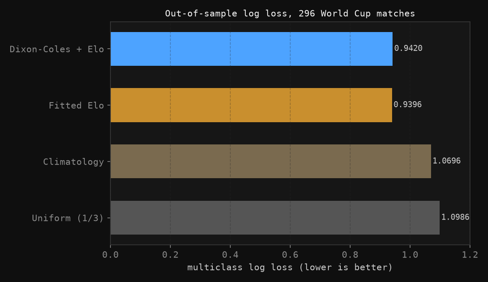
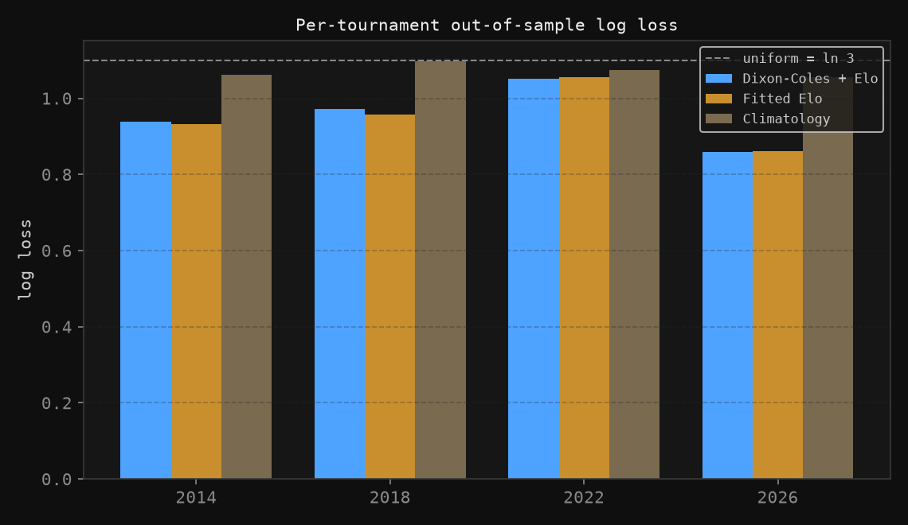
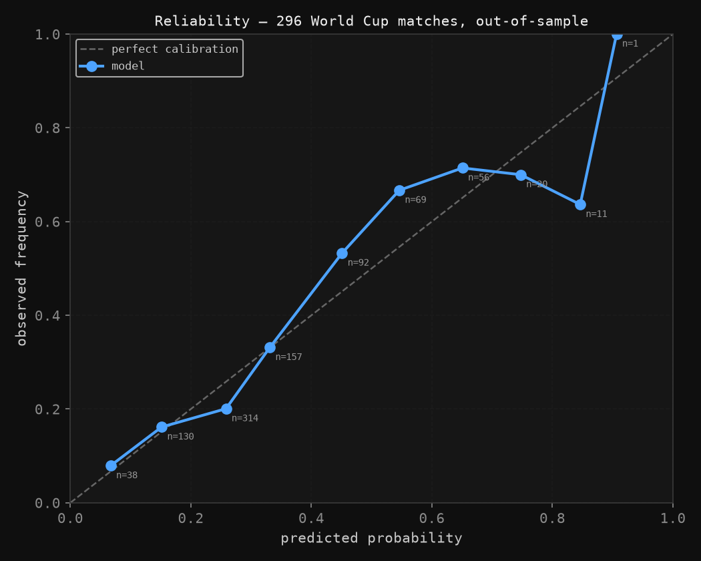

# I Built a World Cup Model, Then Tried to Prove It Was Worthless

*31 August 2026*

> This is part two. Part one — [**Predicting the 2026 World Cup With Math**](part-one.html), published 30 June before the knockout rounds — is the five-layer model this post takes apart. It's worth reading first; everything below is an argument with it.

---

## The problem with the first version

Six weeks ago I published a five-layer model that gave Spain a 32.0% chance of winning the 2026 World Cup. Spain beat Argentina 1–0 in the final on 19 July.

That proves nothing.

A 32% forecast that comes in is what should happen about a third of the time. If I'd said 32% and been wrong, the model would have been equally unfalsified. One tournament is a sample size of one, and the honest response to "my top pick won" is *so what*.

The first version had a deeper problem than that, which I flagged in the original write-up but didn't fix: **every coefficient in it was chosen by me.** The Elo weight of 0.40, the 5% fatigue cap, the 2%-per-standard-deviation referee penalty, the 6% clutch scaling, the +4% host bonus. All of them were numbers that felt right. None had been tested against anything.

So I rebuilt it. The question this version answers is not "who wins the World Cup." It's **"is this model better than a trivial one, and how would I know?"**

The answer turned out to be uncomfortable, and that's the interesting part.

---

## What changed

| | v3 | v4 |
|---|---|---|
| Coefficients | Hand-picked | Fitted by maximum likelihood |
| Data | 2026 group stage, hand-entered | 49,547 internationals, 1872–2026, downloaded |
| Ratings | One FIFA snapshot | Elo fitted over the full match history |
| Validation | None | Walk-forward, 4 tournaments, 296 matches |
| Scoring | None | Log loss, RPS, Brier, ECE, vs. 3 baselines |
| Layers | 5, all retained | Ablated individually; 3 removed |

The data is [martj42/international_results](https://github.com/martj42/international_results) — every senior men's international since 1872, including all 104 matches of the 2026 tournament. Nothing is hand-typed, so nothing is hand-typed wrong.

The critical discipline is **walk-forward validation**. To predict the 2018 World Cup, the model may only use matches played before 14 June 2018. To predict 2026, only matches before 11 June 2026. Every number below is out-of-sample.

---

## Layer 1: Elo, but fitted

Rather than take FIFA's published ranking as given, I ran a global Elo over all 49,547 matches and fitted its parameters by maximum likelihood on the modern era.

$$P(\text{home}) = \frac{1}{1 + 10^{-(R_A - R_B + \eta)/D}}$$

Four free parameters: the update rate $K$, the home-advantage bonus $\eta$ in rating points, the divisor $D$, and an exponent controlling how much margin of victory matters.

**Fitted values: $K = 30$, $\eta = 100$ points, $D = 400$, goal-difference exponent $0.3$.**

The first surprise is $D = 400$. FIFA's published methodology uses **600**, and v3 used 600 because FIFA does. Fitted against 32,429 modern matches, 400 — the chess-standard value — is strictly better. v3 was deliberately less responsive to rating gaps than the data supports.

The second surprise is what happened to match-importance weighting. FIFA scales its updates heavily by competition tier, and I expected the same. The fitted multipliers came out **essentially flat**: 1.0 for major tournaments, 1.0 for qualifiers, 0.9 for friendlies, 1.2 for everything else. Down-weighting friendlies to 0.6, as I'd assumed was obviously correct, made predictions *worse*. A friendly is nearly as informative as a qualifier.

---

## Layer 2: Dixon-Coles, also fitted

The scoreline model is a bivariate Poisson with the Dixon & Coles (1997) correction for low-score dependence, driven by the Elo gap:

$$\log \lambda_A = c + b \cdot \frac{\Delta_{\text{Elo}}}{100} + h \cdot \mathbb{1}[\text{A on home soil}]$$

Fitted separately before each tournament, the coefficients barely move:

| Tournament | $c$ | $b$ | $h$ | $\rho$ | Training matches |
|---|---|---|---|---|---|
| 2014 | +0.1017 | +0.2030 | +0.3168 | −0.0604 | 29,904 |
| 2018 | +0.1009 | +0.2021 | +0.3104 | −0.0583 | 33,682 |
| 2022 | +0.0961 | +0.2029 | +0.3055 | −0.0540 | 37,743 |
| 2026 | +0.0991 | +0.2011 | +0.2975 | −0.0544 | 41,456 |

That stability is reassuring — it says the fit is finding real structure rather than chasing noise. $b \approx 0.20$ means every 100 Elo points is worth about 22% more expected goals. $\rho \approx -0.055$ confirms the Dixon-Coles correction is doing real work: low-scoring draws are more common than independent Poissons predict.

---

## The result I didn't want

Here is the whole model, out-of-sample, on all 296 World Cup matches from 2014, 2018, 2022 and 2026.

| Model | Log loss | RPS | Accuracy |
|---|---|---|---|
| Dixon-Coles + Elo | 0.9420 | 0.1906 | 59.5% |
| **Fitted Elo alone** | **0.9396** | 0.1910 | **59.8%** |
| Climatology (base rates) | 1.0696 | 0.2381 | 44.3% |
| Uniform (1/3 each) | 1.0986 | 0.2412 | 44.3% |

**The bivariate Poisson machinery does not beat a two-parameter Elo.** It is very slightly worse on log loss and accuracy, and very slightly better on RPS. The difference is noise.

This is not a null result overall — both models crush the baselines. Going from a uniform guess to a fitted Elo buys 0.159 nats, which is a large, real edge. But essentially **all of the skill lives in the rating system**, and the elaborate scoreline layer I spent most of my time on contributes approximately nothing.

Per tournament, the picture is consistent:

2022 was the hardest to predict for every method — that was the tournament of Saudi Arabia beating Argentina, Japan beating both Germany and Spain, and Morocco reaching the semi-finals. Good models and bad models both struggled, which is what an unusually high-variance tournament should look like.

---

## Killing my own best layer

The layer v3 was built around is in-tournament attack/defence: teams that scored a lot in the group stage get their expected goals scaled up.

I tested it on knockout matches only, since the group stage is the layer's own input. Then I tested it two ways, and the gap between them is the entire lesson.

| Year | Knockout n | Elo only | Best $w$ | Oracle LL | Walk-forward LL | Verdict |
|---|---|---|---|---|---|---|
| 2014 | 16 | 0.9700 | 0.85 | 0.8888 | — | — |
| 2018 | 16 | 1.0586 | 0.00 | 1.0586 | **2.6407** | Hurts badly |
| 2022 | 16 | 0.8976 | 0.60 | 0.8451 | 0.8495 | Helps slightly |
| 2026 | 32 | 0.7651 | 0.00 | 0.7651 | **1.4888** | Hurts badly |

The "oracle" column picks the blend weight $w$ *on the test set*. It shows an average improvement of 0.034 log loss and looks like a working layer. It is not a real number — it's what you get by letting the model see the answers.

The walk-forward column picks $w$ from previous tournaments only, which is the number you'd actually have had. In 2018 it takes log loss from 1.06 to **2.64**. In 2026, from 0.77 to **1.49**. The layer is worse than useless out-of-sample.

The reason is sample size. Each tournament offers 16 knockout matches to tune against, and the optimal $w$ swings from 0.85 to 0.00 to 0.60 to 0.00 across four tournaments. There is no stable value because there is no signal — just four small samples of noise, each yielding a different confident-looking answer.

**Two more layers died quietly.** The referee-strictness and clutch-factor layers cannot be backtested at all: no historical referee assignments or per-stage player goal/assist splits exist in this dataset. A layer that cannot be tested cannot be defended. I removed both rather than keep them because the story was plausible.

Three of the original five layers are gone.

---

## The one layer that was badly underestimated

v3 gave host nations a +4% bump on expected goals, a number I made up.

Across all 134 World Cup matches ever played by a host on home soil:

- Hosts win **61.2%** of the time, against 50.6% for generic international home matches
- Their mean Elo edge over opponents is only **+15.3 points** — so this is not simply hosts being good teams
- The fitted effect is **×1.77 on expected goals** (generic home advantage: ×1.61)

The v3 assumption was wrong by a factor of roughly nineteen. Home advantage is one of the largest and best-evidenced effects in football, and I had it as a rounding error — while spending paragraphs on a referee layer that turned out to be untestable.

---

## Is it calibrated?

Being accurate and being calibrated are different things. A model that says 70% should be right about 70% of the time.

Pooled over all 888 predicted probabilities: **per-class Brier 0.1850, ECE 0.048.**

That's good in aggregate, but the diagram shows real structure:

| Predicted | n | Observed | Gap |
|---|---|---|---|
| 0.067 | 38 | 0.079 | +0.012 |
| 0.151 | 130 | 0.162 | +0.010 |
| 0.258 | 314 | 0.201 | **−0.058** |
| 0.331 | 157 | 0.331 | +0.000 |
| 0.451 | 92 | 0.533 | **+0.082** |
| 0.546 | 69 | 0.667 | **+0.121** |
| 0.651 | 56 | 0.714 | +0.064 |
| 0.747 | 20 | 0.700 | −0.047 |
| 0.846 | 11 | 0.636 | −0.210 |

Two patterns, one real and one probably not.

**The real one: the model over-predicts draws.** It forecasts a 26.1% draw rate; the actual World Cup rate is 22.0%. That's the crowded 0.2–0.3 bucket with n=314. Rescaling draw probabilities by **×0.80** improves log loss from 0.9420 to 0.9374. World Cup matches — especially knockouts, where a draw means extra time — are more decisive than the general run of internationals the model trains on.

**The one I'm not going to claim: the 0.85 bucket.** Predicted 0.846, observed 0.636, a −0.21 gap that looks like serious overconfidence on heavy favourites. It has **n = 11**. At that sample size the standard error is about 0.14, so this is entirely consistent with chance. It's the kind of gap that would be tempting to write a paragraph of explanation about. I don't have the data to say anything about it.

On knockout matches specifically, calibration is meaningfully worse — ECE 0.147 against 0.048 overall, on the 63 of 80 knockout matches decided inside 90 minutes. Knockouts are a different regime and the model doesn't know it.

---

## Where the ratings ended up

Fitted Elo after the 2026 final:

| # | Team | Elo | | # | Team | Elo |
|---|---|---|---|---|---|---|
| 1 | Spain | 2221.0 | | 6 | Colombia | 2038.7 |
| 2 | Argentina | 2181.8 | | 7 | Portugal | 2035.5 |
| 3 | France | 2089.8 | | 8 | Netherlands | 1987.5 |
| 4 | England | 2075.4 | | 9 | Morocco | 1982.8 |
| 5 | Brazil | 2042.0 | | 10 | Germany | 1977.6 |

And yes — Portugal seventh. I said in the first version that I'm a Ronaldo fan and that the model disagreed with me. It still does, and now it disagrees with me using parameters I didn't choose, which is a considerably harder thing to argue with.

---

## What I'd do next

**Compare against the betting market.** This is the biggest remaining gap. Beating climatology is a low bar; the real test is whether the model finds anything a closing price doesn't already contain. Free historical World Cup odds are hard to source, which is an excuse, not a defence. Without it I can say the model has skill, but not that it has *edge*.

**Fix the draw over-prediction properly** rather than with a post-hoc ×0.80 scale factor — likely a separate draw-inflation parameter fitted on tournament matches only.

**Model knockouts as their own regime.** The calibration gap between 0.048 overall and 0.147 in knockouts says extra time, penalties, and playing-not-to-lose are doing something the general model misses.

**Get more than 296 matches.** Four tournaments is thin. Extending to the Euros, Copa América and the Africa Cup of Nations would roughly quadruple the sample and let me test whether the null result on Dixon-Coles holds up.

---

## What I actually learned

The first version of this project was more fun to build. It had five layers, each with a story, and it produced a confident-looking number. The second version deleted three of those layers, discovered that the remaining machinery adds nothing over a much simpler model, and found that the one assumption I'd been laziest about was the one that mattered most.

The uncomfortable version is the useful one. A model that hasn't been given a real chance to fail isn't a model, it's a narrative with arithmetic in it.

The distinction I'd defend now: this model has **skill** — it beats climatology by 0.13 nats, out-of-sample, across four tournaments. Whether it has **edge** — whether it knows anything the market doesn't — is a question I haven't earned an answer to yet.

Spain winning does not tell me my model was right. Log loss 0.9396 against 1.0696 for the base rate, over 296 matches nobody let me see in advance, tells me something. It's a smaller claim. It's the one I can support.

---

*Full implementation: [wc2026_model_v4.py](wc2026_model_v4.py) — downloads its own data and reproduces every number above from scratch.*

*Data: [martj42/international_results](https://github.com/martj42/international_results), 49,547 matches, 1872–2026. Method: Dixon, M. & Coles, S. (1997), "Modelling Association Football Scores and Inefficiencies in the Football Betting Market", Journal of the Royal Statistical Society Series C, 46(2), 265–280.*
